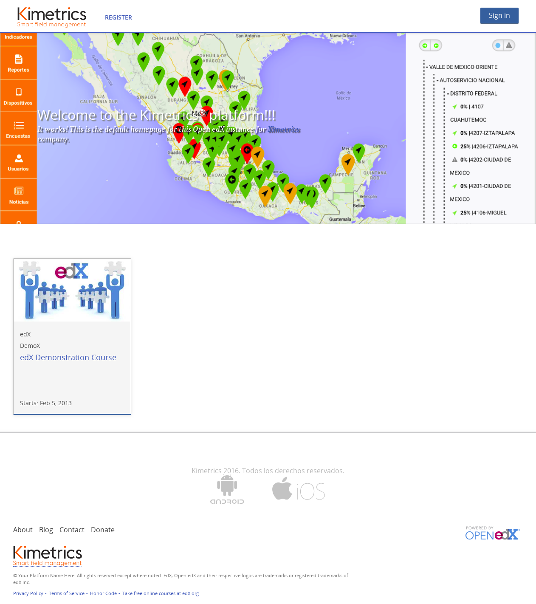
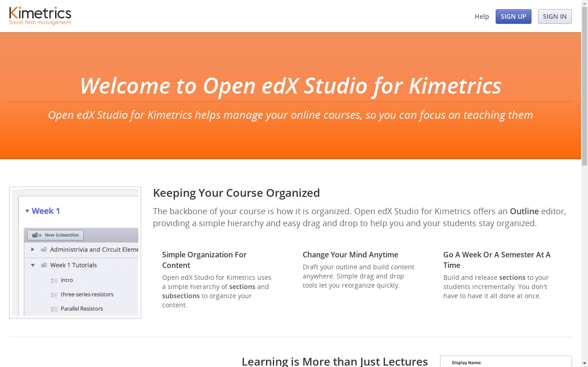

# kimetrics-edx-platform-theme

Kimetrics edX Platform theme for developing comprehensive theme on Open edX.

## Screenshots

The following are some screenshots about this theme:

### LMS App from Open edX Platform

_Figure 1 - LMS App from Open edX Platform_

### CMS App from Open edX Platform

_Figure 2 - CMS App from Open edX Platform_

## How to use

1. Change to `edxapp` user

        $ sudo -u edxapp bash

2. Create a new extra folder on `/path/to/edx/app/edxapp/` called `themes_extras`

        $ mkdir /path/to/edx/app/edxapp/themes_extras

3. Move to that folder

        $ cd /path/to/edx/app/edxapp/themes_extras

4. Clone this repo

        $ git clone https://macagua@bitbucket.org/macagua/kimetrics-edx-platform-theme.git

5. Make some changes in `lms.env.json` located in `/path/to/edx/app/edxapp/`. Then change some variables to this:

       "ENABLE_COMPREHENSIVE_THEMING": true,

       "COMPREHENSIVE_THEME_DIRS": ["/path/to/edx/app/edxapp/themes_extras", "/path/to/edx/app/edxapp/themes"],

       "THEME_NAME": "kimetrics-edx-platform-theme",

5. Make some changes in `cms.env.json` located in `/path/to/edx/app/edxapp/`. Then change some variables to this:

       "ENABLE_COMPREHENSIVE_THEMING": true,

       "COMPREHENSIVE_THEME_DIRS": ["/path/to/edx/app/edxapp/themes_extras", "/path/to/edx/app/edxapp/themes"],

       "THEME_NAME": "kimetrics-edx-platform-theme",

6. Back to _Debian/Ubuntu_ sudo users, and restart the `edxapp` to load new configuration.

        $ exit
        $ sudo /edx/bin/supervisorctl restart edxapp:

7. Run the `update.sh` script. To update assets files and apply the themes.

        $ NO_PREREQ_INSTALL=False paver update_assets lms --settings=aws --debug --theme-dirs /path/to/edx/app/edxapp/themes_extras --themes kimetrics-edx-platform-theme
        $ NO_PREREQ_INSTALL=False paver update_assets cms --settings=aws --debug --theme-dirs /path/to/edx/app/edxapp/themes_extras --themes kimetrics-edx-platform-theme

# Reference

- .

- .

- .
